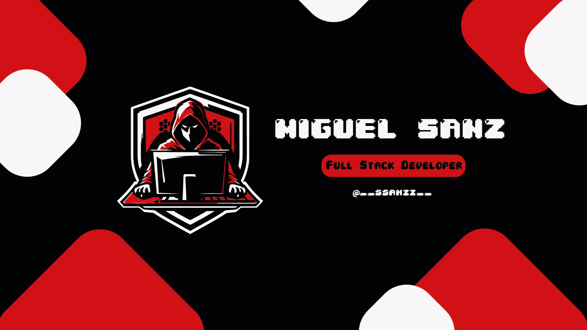

<h1 align="center">
    
</h1>

<h2>
    𝑴𝒊𝒈𝒖𝒆𝒍 𝑺𝒂𝒏𝒛
  </a>
  
</h2>

 

- 🔭 I’m currently working on **a full-stack web application integrating React.js and Node.js**

- 🌱 I’m currently learning **React and Express**

- 🤝 I’m looking for help with **developing / optimizing websites**

- 👨‍💻 All of my projects are available at [https://www.danigarridonunez.com](https://www.danigarridonunez.com)

- 📫 How to reach me **danigarridonunez@gmail.com**

 
 
 
 

<h3 align="center">𝐂𝐨𝐧𝐞𝐜𝐭𝐚 𝐜𝐨𝐧𝐦𝐢𝐠𝐨:</h3>

  
  
  

 

<h3 align="center">𝐋𝐚𝐧𝐠𝐮𝐚𝐣𝐞𝐬:</h3>

  

 

<h3 align="center">𝐇𝐞𝐫𝐫𝐚𝐦𝐢𝐞𝐧𝐭𝐚𝐬:</h3>

  

### ⚙️ &nbsp;GitHub Analytics

## 🏆 GitHub Trophies

